## SQL Intro
- SQL = structured query language
- schema definition
    - CREATE TABLE <table> (<table-def>)
        - <table> is the table name
        - <table-def> is comma-separated column definitions
        - Column definition is of form <col-name> <col-type>
    - CREATE TABLE Courses(Cid int, Cname text)
- constraints
    - tables
        - Students: Sid, Sname, Gpa
        - Enrollment: Sid, Cid
        - Courses: Cid, Cname

    - integrity constraints
        - limit admissible content of tabel
        - added via ALTER TABLE command
        - or can define when creating table
    - primary key constraint
        - refers to a single table
        - identifies a subset of columns as key columns
        - no two rows have the same value sin key columns
        - syntax
            - ALTER TABLE <table>
            - ADD CONSTRAINT Primary Key (<key-cols>)
                - <key-cols> is comma-separated list of column names
            - e.g. ALTER TABLE Enrollment ADD PRIMARY KEY(Sid, Cid);
    - foreign key constraint
        - links two tables
        - Identifies set of foreign key columns in table 1
        - Maps foreign key columns to primary key of table 2 
        - Values in foreign key column must appear as primary key 
        - Maps each row in table 1 to a row from table 2
        - syntax
            - ALTER TABLE <table-1>
            - ADD Foreign Key (<fkey-columns>) 
            - REFERENCES <table-2> (<pkey-columns>);
                - <table-1> is table with foreign key columns 
                - <fkey-column> is comma-separated foreign key columns 
                - <table-2> is table with primary key columns 
                - <pkey-columns> is comma-separated primary keys
            - ALTER TABLE Enrollment 
            - ADD FOREIGN KEY(Sid) REFERENCES Students(Sid);
- inserting data
    - insert one (fully specified) row into a table:
        - INSERT INTO <table> VALUES (<value-list>) 
    - Inserting one (partially specified) row into a table:
        - INSERT INTO <table> (<column-list>)  VALUES (<value-list>)
        - other columns are null
    - Loading data from a file into a table:
        - COPY <table> FROM <path> 
        - DELIMITER <delimiter> NULL <null-string> CSV
        - COPY Courses FROM 'courses.csv' DELIMITER ',' CSV
- deleting data
    - Deleting rows from a table that satisfy condition:
        - DELETE FROM <table> WHERE <condition>
    - DELETE FROM Courses WHERE Cname = 'CS6320'
- updating data
    - Updating specific rows and columns to new value:
        - UPDATE <table> 
        - SET <column> = <value>  WHERE <condition>
    - Changes rows satisfying <condition>  by writing <value> in <column>
    - UPDATE Courses SET Cid = 7 WHERE Cname = 'CS4320'

## SQL: simple analysis
- An SQL query describes a new relation to generate 
    - SELECT: describes columns of relation to generate 
    - FROM: describes source relations and how to match 
    - WHERE: defines conditions result rows must satisfy
- simple query format
    - SELECT <columns>
    - FROM <table1> JOIN <table2> ON (<join-pred>) ...
    - WHERE <where-pred>
        - <columns> is comma-separated list of columns 
        - <table1> and <table2> are database relations 
        - <join-pred> is condition defining matching tuples pairs 
        - <where-pred> are additional conditions
    - SELECT Students.Sname FROM Students #discard all columns except for Sname
    - JOIN Enrollment ON (Students.sid = Enrollment.sid) 
    - JOIN Courses ON (Enrollment.cid = Courses.cid)  
    - WHERE Courses.Cname = 'CS4320'
- simplification by alias
    - SELECT S.Sname 
    - FROM *Students S*
    - JOIN *Enrollment E* ON (S.sid = E.sid) 
    - JOIN *Courses C* ON (E.cid = C.cid)  
    - WHERE C.Cname = 'CS4320'
- More Diverse Predicates
    - inequalities (>, >=): Students.scores > 70 
    - "not equal": Courses.Cname <> 'CS4320' 
    - Check if value in list: Cname IN ('CS4320', 'CS5320') 
    - Regular expressions: Cname LIKE 'CS_320%'
        - % stands for zero or more arbitrary characters 
        - _ stands for one arbitrary character
- composite predicates
    - AND, OR, NOT
- Diverse Select Clauses
    - Shortcuts for selecting multiple columns
        - * selects all columns
        - <table>.* selects all columns from <table>
    - Can use arithmetic expressions in select clause
        - E.g., SELECT 3 * (<column1> + <column2>) 
    - Can assign new names for output columns
        - E.g., SELECT Sname as StudentName
- Join Syntax Alternatives
    - Simply specify names of columns that appear in multiple tables
        - <table1> JOIN <table2> USING (<column>) 
        - Abbreviates <table1> JOIN <table2> ON (<table1>.<column> = <table2>.<column>)
    - "Natural joins" match values in columns with same name
        - <table1> NATURAL JOIN <table2>
        - Introduces equality conditions between columns of same name
    - No join keyword: FROM <table1>, <table2> WHERE <join-condition>
- distinct results
    - SELECT ... may generate the same row multiple times 
    - Use SELECT DISTINCT instead to eliminate duplicates
- aggregation queries
    - SQL Aggregates: COUNT, SUM, AVG, MIN, MAX
        - COUNT(*) for counting rows in result relation
        - COUNT(<column>) counts rows with value in <column>
        - COUNT(DISTINCT <column>) counts number of distinct values in <column> in result relation
- aggregation by group
    - example
        - Use SQL GROUP-BY clause to define data subsets
            - GROUP BY <column-list> 
            - distinguish data subsets based on their values in specified columns
        - SELECT Count(*), Cname FROM Students 
        - JOIN Enrollment ON (Students.sid = Enrollment.sid) 
        - JOIN Courses ON (Enrollment.cid = Courses.cid)  
        - WHERE Cname IN ('CS4320', 'CS5320')
        - GROUP BY Cname
        - # count rows in each group and report count with course name (unique per group).
    - details
        - Grouping is applied after pairing data sources (FROM) and filtering rows (WHERE)
        - Result contains one row per group
            - Implies restrictions on SELECT clause!
        - Condition in WHERE clause applies to single rows (evaluated before grouping)
        - HAVING clause specifies conditions on groups (evaluated after grouping)
            - e.g. HAVING Count(*) >= 100

## Advanced SQL Features
- syntax for ordering
    - ORDER BY <order-item-list>
        - <order-item> : <column> <direction> 
        - <direction> : either ASC or DESC
        - Orders result rows by values in order items 
        - Applied after grouping (for group-by queries)
            - Items must have unique value per group
- Limiting Output Size
    - Limit <Number> : only shows first <Number> result rows
- Unknown Values
    - unknown values are called NULL values in SQL 
    - SQL uses Ternary (i.e., Three-Valued Logic)
        - Outcome may be true, false, or unknown 
    - Check for corresponding outcome
        - <expression> = TRUE
        - <expression> = FALSE
        - <expression> IS NULL (not: "= NULL")
    - Guess (or try in PostgreSQL) the results:
        - SELECT 3 = NULL
        - SELECT NULL = NULL 
        - SELECT NULL IS NULL 
        - SELECT NULL IS NOT NULL 
        - SELECT TRUE OR NULL 
        - SELECT TRUE AND NULL
- Joins with Unknowns 
    - https://www.sqlshack.com/sql-outer-join-overview-and-examples/
    - Standard join keeps only matching row pairs 
    - Eliminates rows without matching rows in other table 
    - Sometimes we want to keep rows regardless
    - Can do that with OUTER JOINs
        - Fills up fields in missing row with NULL values

    - Keep each row in left table (plus standard join result):
        - <table-1> LEFT OUTER JOIN <table-2> ON ... 
    - Keep each row in right table (plus standard result):
        - <table-1> RIGHT OUTER JOIN <table-2> ON ... 
    - Keep rows in both tables (plus standard result):
        - <table-1> FULL OUTER JOIN <table-2> ON 
    - example
        - SELECT Sname, Count(*)
        - FROM Students LEFT OUTER JOIN Enrollment 
        - ON (Students.sid = Enrollment.sid) GROUP BY Sname
        - # Will count one row for students without enrollments!
        - Count(cid)
            - # Count only students matched against courses
- Set Operations
    - Union result tuples from two queries
        - <query-1> UNION <query-2> : eliminates duplicates
        - <query-1> UNION ALL <query-2> : keep duplicates 
    - Intersect results from two queries
        - <query-1> INTERSECT <query-2> Set difference between queries
        - <query-1> EXCEPT <query-2>
    - Results from <query-1> and <query-2> must be union-compatible
- Query Nesting
    - Can use queries as part of another query, e.g.
        - Query instead of table in FROM clause
        - Query instead of conjunct in WHERE clause
    - example
        - SELECT Sname FROM Students
        - WHERE gpa >= (SELECT MAX(gpa) FROM Students)
- Sub-Queries in Conditions
    - Check if sub-query result is empty
        - EXISTS(<sub-query>) : TRUE if non-empty 
    - Check if sub-query result contains value
        - <value> IN (<sub-query>) : TRUE if contained 
    - Check if condition holds for all/some sub-query rows
        - E.g., <value> >= ALL(<sub-query>) : TRUE if satisfied for all 
        - E.g., <value> >= ANY(<sub-query>) : TRUE if satisfied for some
- Correlated Sub-Queries
    - sub-query refers to the "outside"
    - example
        - SELECT S1.Sname FROM Students S1 WHERE S1.gpa >=
        - ALL(SELECT S2.gpa FROM Students S2  WHERE S1.Sname = S2.Sname)
        - #get students with max gpa with the same name
    - Evaluating Correlated Sub-Queries
        - Iterate over rows from outer (containing) query 
        - Evaluate sub-query for fixed row in outer query 
        - (Decide whether outer row belongs into result)
    - example
        - SELECT S1.Sname FROM Students S1 WHERE
        - EXISTS (SELECT S2.gpa FROM Students S2  
        - WHERE S1.gpa < S2.gpa)

## Data storage
- tape storage
    - Bits as magnetic information on tape
    - Very slow access (10s of seconds)
    - Moderate read speed (up to 300 MB/second)
    - Very cheap (around $0.02 per Gigabyte [source])
    - Used for long-term archival (e.g., by Google)
- hard disk
    - Bits as magnetic information on platter
    - Patters spin under read/write heads
    - Slow access (10s of milliseconds access time) Moderate read speed (around 200 MB/second) Cheap (around $0.035 per Gigabyte)
    - Used for less frequently accessed data
- solid state drives
    - Bits as small electric charges
    - Elevated price (around $0.25 per Gigabyte) Fast access (around 1 millisecond)
    - Elevated speed (around 500 MB/second) Limited number of write cycles (memory wear)
- main memory
    - Bits as small electric charges
    - Expensive (several dollars per Gigabyte)
    - Very fast access (order of nanoseconds)
    - High bandwidth (Gigabytes per second)
    - Used to access hot data - all if economically feasible!
- caches
    - Bits as small electric charges
    - Typically organized as cache hierarchy
    - Very expensive (hundreds of dollars per Gigabyte) 
    - Near-instantaneous access (few nanoseconds) 
    - Very high bandwidth (tens of Gigabytes per second) 
    - Used to store immediately relevant data
- Relevance for DBMS
    - Data access speed may become bottleneck
        - Design algorithms to minimize data movements
    - Random data access is expensive
        - Read data in larger chunks ("pages")
        - Keep related data close together
- Tables as files
    - Table schema information is stored in database catalog 
    - Table content is stored as collection of pages ("file") 
    - Each page typically stores a few KB of data
    - Enough to store multiple rows but not entire table
- From files to pages
    - Possibility 1: store pages as (doubly) linked list
        - Each page contains pointers to next/prior page
        - Can use separate lists for full/partially empty pages 
        - Reference to header page stored in DB catalog
    - Possibility 2: directory with pointers to pages
        - Directory pages reference data pages with meta-data
- from pages to slots
    - Pages are divided into slots
    - Each slot stores one record (i.e., table row) 
    - Can refer to records via (pageID, slotID) 
    - Multiple ways to divide pages into slots 
    - Fixed-length vs. variable-length records
    - Fixed-Length Records
        - Number of bytes per slot is determined a-priori
        - Need to keep track of which slots are used (insertions ...) 
        - Packed representation uses consecutive slots
            - Only keep track of number of slots used
            - problem with deletions
        - Unpacked representation allows unused slots in-between
            - Need bitmap to keep track of used slots
    - variable length records
        - E.g., records with variable-length text fields 
        - Number of bytes per slot is not fixed a-priori 
        - Each page maintains directory about used slots
            - Store first byte and length of slots 
        - Flexibility to move around records on page
            - Can use that for regular compaction
- From Slots to Fields
    - Must divide each slots into fields
    - Fixed length vs. variable length fields 
    - Fixed length: store field sizes in DB catalog 
    - Variable length: store field sizes on page
        - Option 1: use special delimiter symbol between fields 
        - Option 2: store "field directory" at beginning of record
- summary: files
    - decomposing
    - tables into pages
    - pages into slots
    - slots into fields
- Row Stores vs.  Column Stores
    - So far: have seen how to store data "row-wise"
        - I.e., data for same row is close together
        - This is done by traditional DBMS like Postgres 
    - Can also store data "column-wise"
        - I.e., data for same column is close together 
        - Can help if queries access only few columns 
        - Will see corresponding systems later ...

## Tree Indexes
- how it works
    - Index stores references to data records
        - I.e., stores page IDs and slot IDs
    - Index groups records by values in specific columns 
    - Those columns are called the index search key
    - Index retrieves records for specific search key values
- 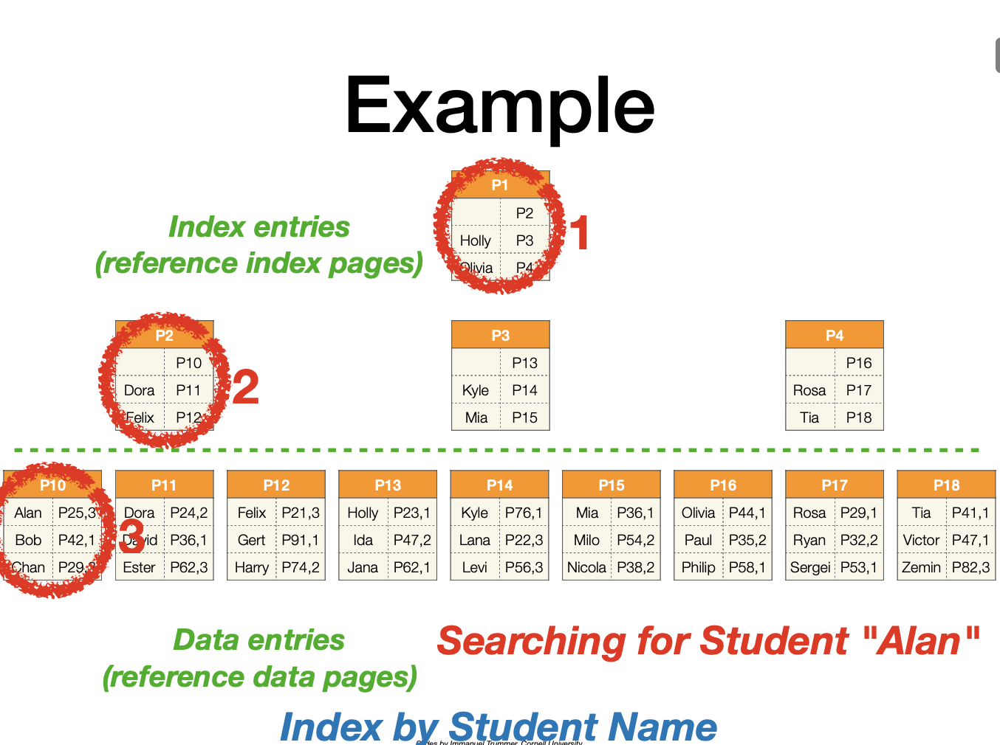
- index node content  
    - K: key
    - R: reference
    - Content of inner nodes:
        - R(0), K(1), R(1), K(2), R(2), ...
        - R(i) leads to entries (strictly) ordered before K(i+1) 
        - R(i) references an index page
    - Content of leaf nodes:
        - K(1), R(1), K(2), R(2), K(3), R(3), ...
        - R(i) leads to data entries with key K(i)
        - R(i) references a data page and a slot on that page
- where to use tree indexes?
    - use for queries with equality preidcates
        - E.g., ... WHERE Sname = 'Alan'
    - Can use index for queries with inequality predicates
        - E.g., ... WHERE gpa > 3
    - Both cases: works if predicate references index key
- Using Index for Equality
    - Searching for entries with key value V 
        -> Start at root node 
    - Until reaching a leaf node:
        - Search for i such that V ≥ K(i), V < K(i+1)
        - Follow associated reference R(i) 
    - At leaf node:
        - Search for i such that K(i) = V
        - Retrieve data from R(i) if found, otherwise return empty
- linking leaf nodes
    - store pointer to next/previous neighbor in leaf 
    - Leaf pages essentially become doubly linked list
- Using Index for Inequalities
    - Searching for index entries with key value from [L,U] 
    - Use equality search procedure to find entry with value L 
    - Follow links between leaf nodes until reaching value U 
    - Retrieve referenced data on the way
- composite keys
    - Index search key may consist of multiple columns 
    - Must decide priority order between key columns 
    - Key comparisons use that priority order
        - I.e., consider second column if same value in first etc. 
    - Can use index for (in)equalities on prefix of key columns
- Indexes in Postgres
    - CREATE INDEX <index-name> on <table> (<columns>)
        - Creates index for table using specified search key 
        - Refer to index later via <index-name> 
        - <columns> is comma-separated column list (key)
    - DROP INDEX <index-name>
        - Delete index with given name
    - Too many indexes can be bad for performance
- Concise Data Entries
    - Many references for same search key value?
    - Optimization: store search key value with reference list 
    - Advantage: avoids storing key values redundantly 
    - Disadvantage: creates variable length field (list)
- merging index and data
    - Idea: index stores data instead of references to data 
    - This is called a *clustered index*
    - Can have at most one clustered index per table (why?) 
        - Clustered index defines the way in which data is ordered physically on the disk. 
        - there can only be one way in which you can order the data physically.
    - More efficient as it saves chasing one reference
    - More importantly: collocates data with same key
- handling updates
    - If data changes, so must the index!
    - Need to change index in case of inserts/deletes 
    - Ideally: want to keep index balanced during updates
    - updates without balancing
        - Lots of overflow pages reduce performance 
        - Empty pages lead to space overheads
- B+ trees
    - default index in Postgres
    - Balances tree after insert/delete operations 
    - Keeps the tree compact
        - Each node (except root) is at least half full!
        - I.e., number entries between d and 2*d (d is "order")
    - B+ Trees Are Shallow
        - Typical order is 100, typical fill factor 67%
        - Average fanout (i.e., number of child nodes) is 133
        - Second level can have 133^2 = 17,689 nodes
    - 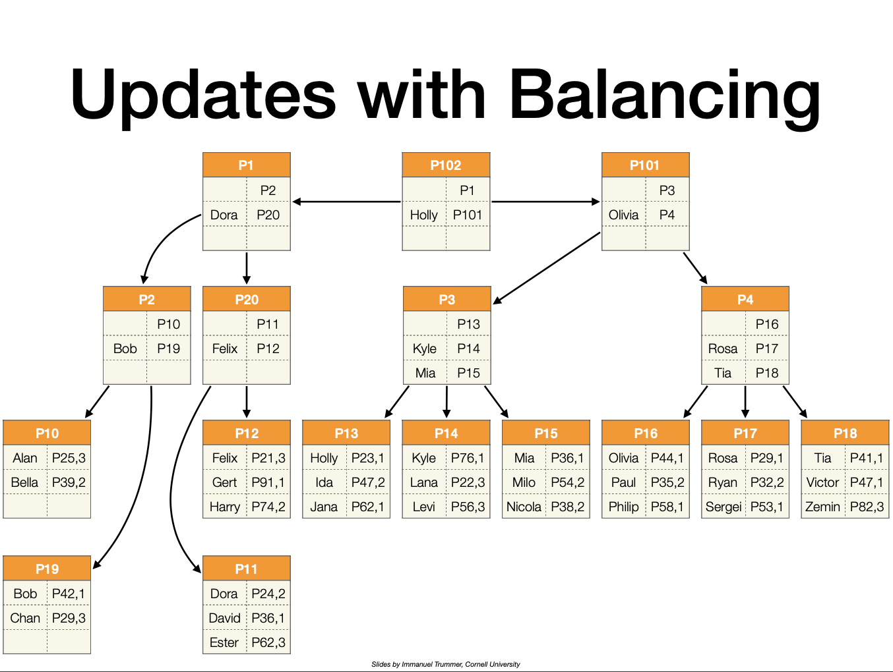
    - Typically, expect even number of maximal entries
        - I.e., maximal number of entries is 2 * [order]
        - Nodes are "underfull" with less than [order] entries 
    - Have up to three entries per node in our example 
    - Will consider nodes with one entry as "underfull"

## Hash indexes
- Supported Predicates
    - tree indexes
        - Tree indexes are based on a sort order between keys
        - Can handle equality and inequality conditions
            - Consecutive keys stored close together 
        - Composite keys: useful for conditions on key prefix
            - Keys with same prefix value stored close together
    - hash indexes
        - based on key hash values
        - Only useful for equality conditions
            - Consecutive keys may be stored far apart
                - Similar hash value != similar key value 
            - Condition must constrain all components
                - Keys with same prefix may be stored far apart
- static hashing
    - Hash bucket pages contain references to data
        - Alternatively, may contain data directly
    - Hash buckets are associated with hash value ranges 
    - Can use hash index to find entries with key V
        - Calculate hash value h for V as h(V) 
        - Look up bucket page associated with h
    - e.g. PageID = Hash % NrBuckets
    - updates
        - Deletions are easy - just remove associated entries 
        - Insertions are more difficult - what if bucket is full?
            - Can add "overflow" pages (like ISAM index!)
            - Initial bucket page stores pointer to first overflow page 
            - Overflow pages form linked list if more than one
        - Can rehash if number of overflow pages increases
    - pros/cons
        - Can get data with one read
        - May need multiple reads in case of overflow pages 
        - Will waste space if too many deletions (empty pages) 
        - Can use rehashing but creates significant overheads
- extendible hashing
    - Extendible Hashing
    - Idea: use directory to map hash buckets to pages
        - More flexible than using page IDs directly 
    - Redistribute overflowing buckets to multiple pages
        - More efficient than having to rehash all data 
    - Need to increase directory size if too many splits
    - 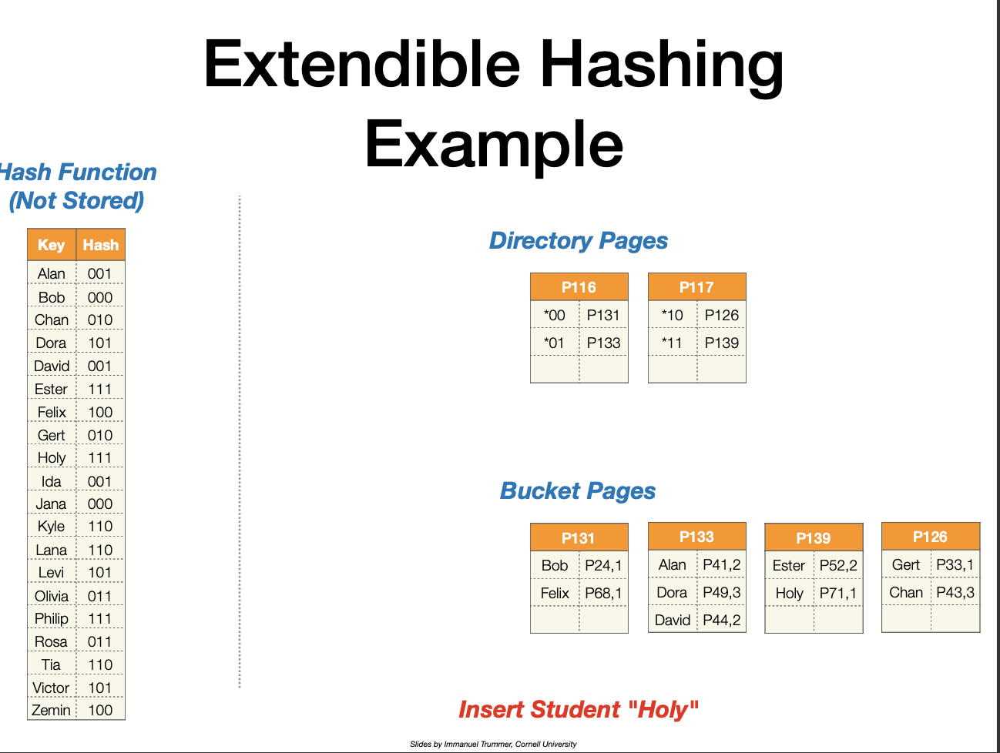
    - Calculate hash value for key of new entry 
    - Consult directory to identify current bucket 
    - Current bucket has space? Simply insert. 
    - Current bucket is overflowing?
        - Add new bucket page, rehash existing and new entry
            - For rehashing: consider one more bit of hash value 
            - Expand directory if it does not consider enough bits
    - Global depth
        - how many hash bits directory considers
    - Local depth
        - how many hash bits for specific bucket
    - 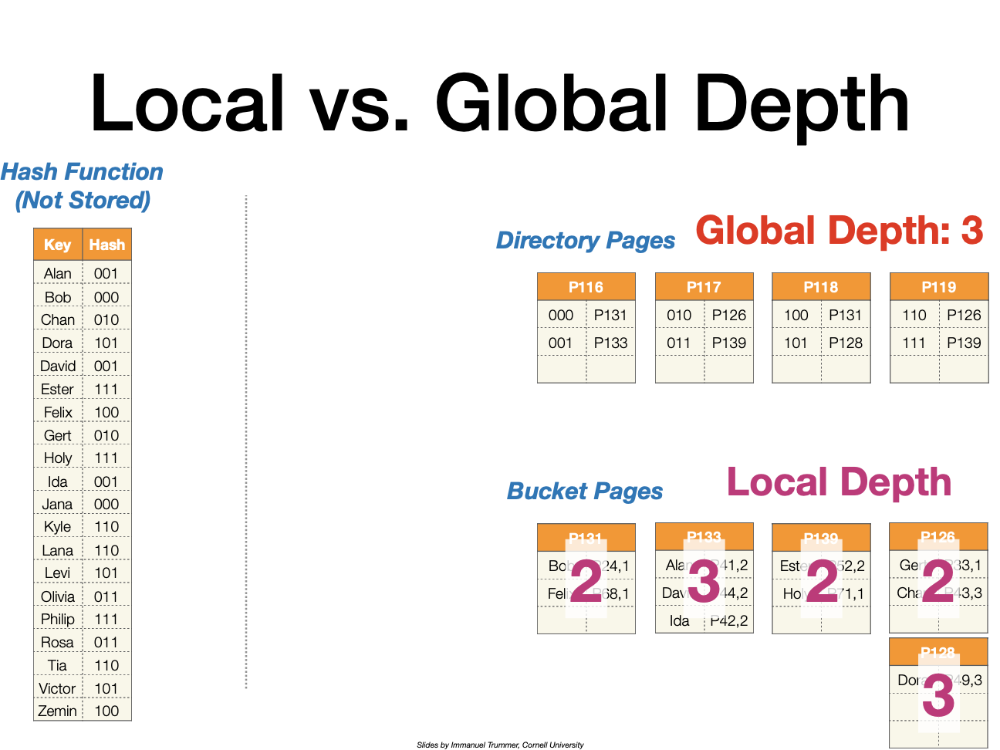
    - deletions
        - Can merge bucket pages if they become empty 
        - Can half directory size if number of buckets shrinks 
        - Often no compaction in practice
            - Assumption: inserts are more common than deletes
    - pros/cons
        - Avoids overflow pages
        - No need for expensive rehashing
            - Only rehash one bucket at a time 
        - Need additional directory access 
        - Need to double directory occasionally
            - This may take up some time
- linear hashing
    - idea: avoid directory by fixing next bucket to split
        - Means we do not always split overflowing bucket! 
        - I.e., we may have temporary overflow pages 
        - Buckets to split are selected in round robin fashion 
        - Means overflowing bucket will be split eventually
    - 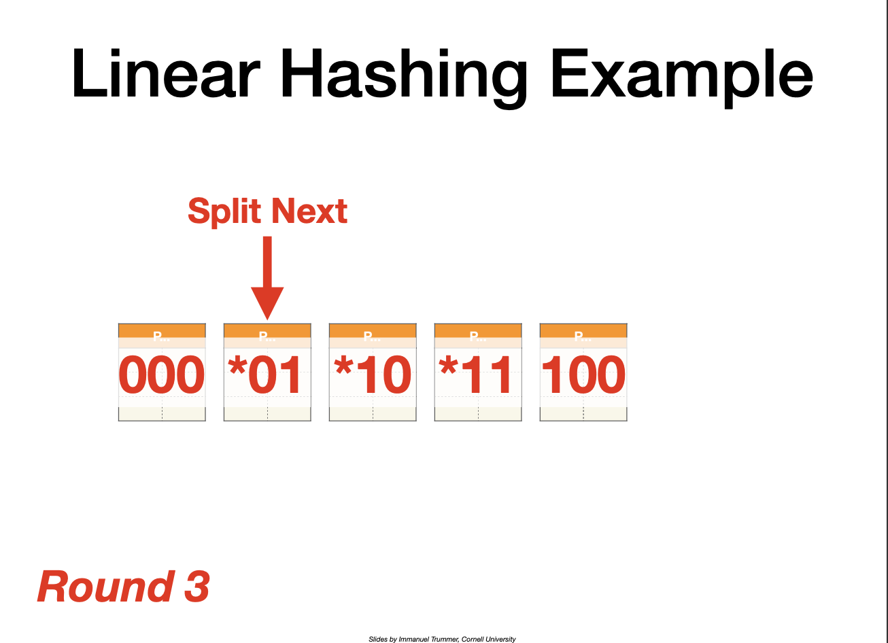
    - Insertions Summary
        - Calculate hash value for new entry to insert
        - Add entry on page or - if necessary - on overflow page 
        - Split next bucket if trigger condition is satisfied
            - May eliminate previously generated overflow pages 
            - Some flexibility in choice of trigger condition
        - Splitting proceeds in rounds
            - All buckets present at round start split -> round ends 
            - "Next Split" pointer is reset to first page at round end
        - We always split the bucket pointed to by "Next Split"
            - Add one new page, redistribute split bucket entries
            - Consider one more bit when redistributing
        - pros/cons
            - Avoids a directory 
                - no expensive directory doubling 
            - May temporarily admit overflow pages
            - May split empty pages 
                - inefficient space utilization
- optimizations
    - Can apply same optimizations as for tree indexes 
    - Have many entries for same search key value?
        - Store key value, followed by list of references 
    - Want to get rid of one level of indirection?
        - Can store data directly instead of references
            - Leads to "clustered index", only one per table! 
            - "Clustered index" in general: data sorted by index key
- Choose Index Type in Postgres
    - CREATE INDEX <index-name> ON <table>  USING <method> (<column-list>)
    - Can choose btree or hash for method

## query processing overview
- buffer manager
    - decides when to move data between disk and RAM
    - manages buffer pool
    - why not rely on OS?
        - DBMS knows its access patterns ahead of time
            - Can exploit for smarter replacements
        - DBMS must control page writes for safety guarantees
- frame properties
    - page ID
    - pin count
        - how many processes are using a page
        - Can only evict page if pin count reaches zero
    - Dirty bit
        - in-memory page deviates from disk version?
        - Must write page to disk before evicting it 
- processing page requests
    - Case 1: Cache Hit (requested page cached)
        - Increase pin count and return page address 
    - Case 2: Cache Miss (requested page not cached)
        - Choose frame for replacement (replacement policy) 
        - If frame contains dirty page then write it to disk 
        - Read requested page from disk and store in frame 
        - Increase pin count and return page address
- LRU replacement policy
    - Want to replace page required farthest in the future
        - oing so reduces expensive cache misses 
    - However: difficult to predict that in general 
    - Heuristic: remove least recently used page (LRU)
        - Did not use page for long time, unlikely to do soon 
- sequential flooding
    - DBMS often have particular access patterns
    - For instance: keep scanning pages in round robin mode 
    - Least recently used page is used again soonest
    - Makes LRU policy highly sub-optimal
    - Otherwise a reasonable strategy!
- query processing
    - Input query is parsed (Parser) and simplified (Rewriter) 
    - Query optimizer generates optimized execution plan 
    - Executing plan (Executor) produces query result
- query plans
    - Describe how to generate required data 
    - Typically represented as a tree
    - Each leaf node represents a database table 
    - Each inner node represents an operation 
    - Tree edges represent data flow
    - Filter operator (𝛔): discard rows based on condition 
    - Projection operator (𝛑): discard columns
    - Join operator (⨝): find matching tuple pairs
    - 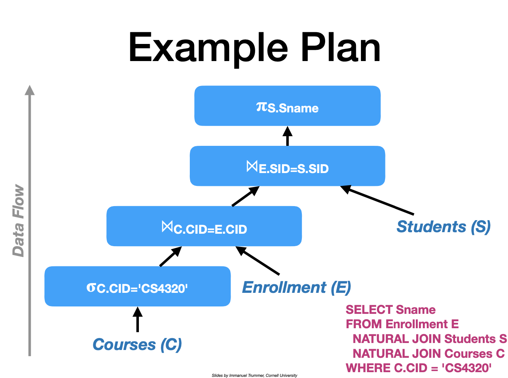

## query processing overview
- 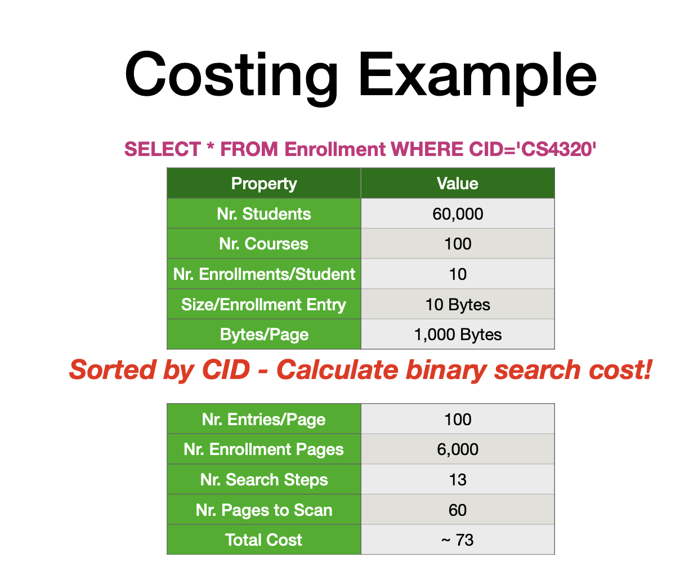
    - ceil(log_2(6000)) = 13
- 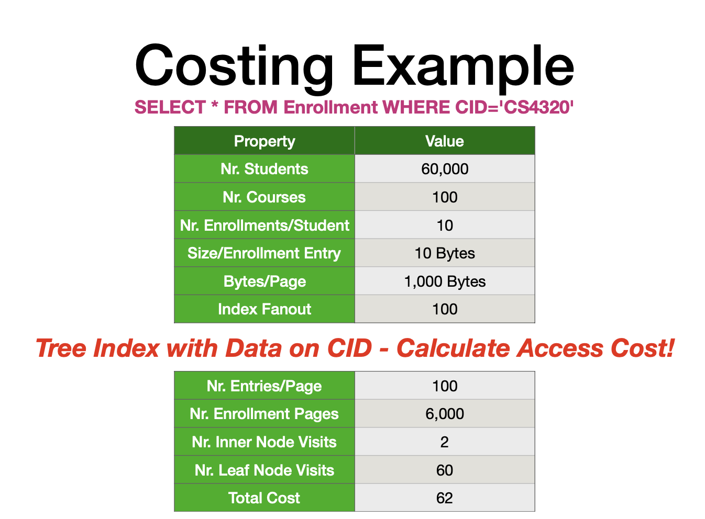
    - height = 3, read 2 inner nodes
- 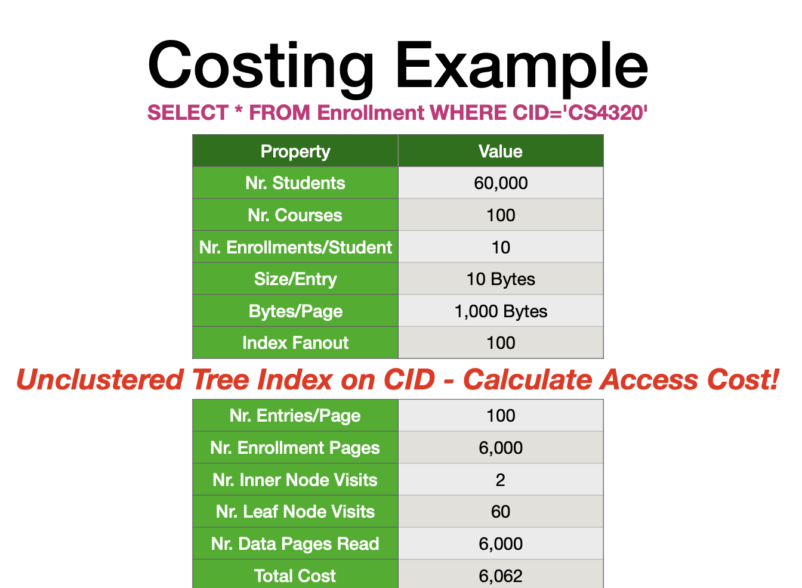
    - need to read data pages for 6k entries
    - pessimistically assume each on a diff page
- page nested loop join
    - Load one page after the other from first (outer) table 
    - For each page from outer table:
        - Load one page after the other from second table 
        - For all tuples in memory: check and add to result
    - loadPage(P)
        - load page P
    - Pages(T)
        - pages of table T
    - Tuples(P)
        - tuples of page P
    - code
        ```
        for ep in pages(E):
            loadPage(ep)
            for sp in pages(S):
            loadPage(sp)
            for et in tuples(ep), st in tuples(sp):
                if (et.Sid = st.Sid):
                    output(et x st)
        ```
    - Cost = pages in E * load cost + 
        pages in E * pages in S * load cost +
        tuples in E * tuples in S * evaluation cost
    - memory
        - store current page from outer table
        - store current page from inner table
        - buffer page to store output (before disk write)
- Block Nested Loop Join
    - read inner table for each outer block
    - More efficient as block contains multiple pages
    - PageBlocks(T, b): Blocks of b pages from T 
    - LoadPages(B): Load pages from block B
    - code
        ```
        for ep in pageBlocks(E,b):
            loadPages(ep)
            for sp in pages(S):
                loadPage(sp)
                for et in tuples(ep), st in tuples(sp):
                if (et.Sid = st.Sid):
                    output(et x st)
        ```
    - Cost = pages in E * load cost + blocks in E * pages in S * load cost
    - memory
        - store blocks from outer relation 
        - store one page from inner relation
        - one page to store output (before writing to disk)
- index nested loop join
    - Idea: have index on join column and equality predicate 
    - Iterate over pages of non-indexed (outer) table
    - For each outer tuple, use index to find matching tuples
    - Index(Predicate): Entries satisfying predicate 
    - Tuple(P, i): i-th tuple on page P
    - code
        ```
        for ep in pages(E):
            loadPage(ep)
            for et in tuples(ep):
                for <sp, i> in Index(et.Sid = st.Sid):
                    loadPage(sp)
                    output(et x tuple(sp, i))
        ```
    - Cost = pages in E* load cost + index entries * load cost
    - memory 
        - Need one page to store current page from outer table 
        - Need one page to store current page from inner table 
        - Need one page as output buffer (before disk write)
- hash join
    - Want tuples with same value in join column
    - Same value in join column implies same hash value 
    - Join Phase 1
        - Partition data by hash values in join columns
        - Make partitions small enough to fit into memory 
    - Join Phase 2
        - Join each partition pair (same hash value) separately
    - Hash(Tuple): Calculates hash function for tuple 
    - Full(P): Whether page P has no more space left 
    - WriteAndClear(P): Write P to disk and erase
    - code
        ```
        #Phase 1
        for ep in pages(E):
            loadPage(ep)
            for et in tuples(ep):
                add et to EB[Hash(et)]
                if (Full(EB[Hash(et)])):
                    writeAndClear(EB[Hash(et)])
        # Cost = pages in E* IO cost * 2
        # do the same for S
        # Cost = pages in S* IO cost * 2

        #phase 2
        for h in hash values:
            loadPages(EB[h])
            for sp in pages(SB[h]):
                load(sp)
                for ep in pages(EB[h]), st in sp, et in ep:
                if (et.Sid = st.Sid):
                    output(et x st)
        # Cost = (pages in E in S) * IO cost
        ```
    - memory
        - Phase 1
            - Space to store current page read for partitioning
            - Store one buffer page for each hash bucket 
        - Phase 2
            - Store all pages from one hash bucket 
            - Store current page from other table bucket 
            - One output buffer page
    - how many buckets
        - Constraint in Phase 1
            - 1 + Nr. Buckets <= Memory
        - Constraint in Phase 2
            - 2 + Nr. Pages in Smaller Table/Nr. Buckets <= Memory
        - Rule of thumb
            - Want memory > Sqrt(Nr. Pages in Smaller Table) 
            - memory = available buffer
        - total cost = 3 * (pages in E + pages in S)
    - lack memory
        - perform multiple passes over data in phase 1
        - In each pass, buckets are partitioned into sub-buckets 
        - Iterate until data per bucket fits into main memory
- Sort-Merge Join
    - Also specific to equality join conditions 
    - Phase 1 (Sort)
        - Sort joined tables on the join column 
    - Phase 2 (Merge)
        - Efficiently merge sorted tables together
    - join phase 1 overview
        - Lots of sorting algorithms proposed in the literature 
        - However, typically assume that we access single entries 
        - But random data access can be very inefficient
        - Hence, want to access pages of entries instead
        - Need specialized ("external") sort algorithms
        - algorithm sketch
            - Step 1: load chunk of data and sort, write back to disk 
            - Step 2 .. n: merge sorted runs to produce larger runs 
            - Each merging step reduces number of runs (but longer) 
            - Finally, have only one sorted run left - we're done!
    - details on step 1
        - Assume we have B buffer pages available 
        - Load chunks of B pages into the buffer
        - For each chunk, sort by standard sort algorithm
            - Can use standard algorithm as all data in memory 
        - Then, write sorted data to hard disk
        - A sorted sequence of data is called a "run"
        - 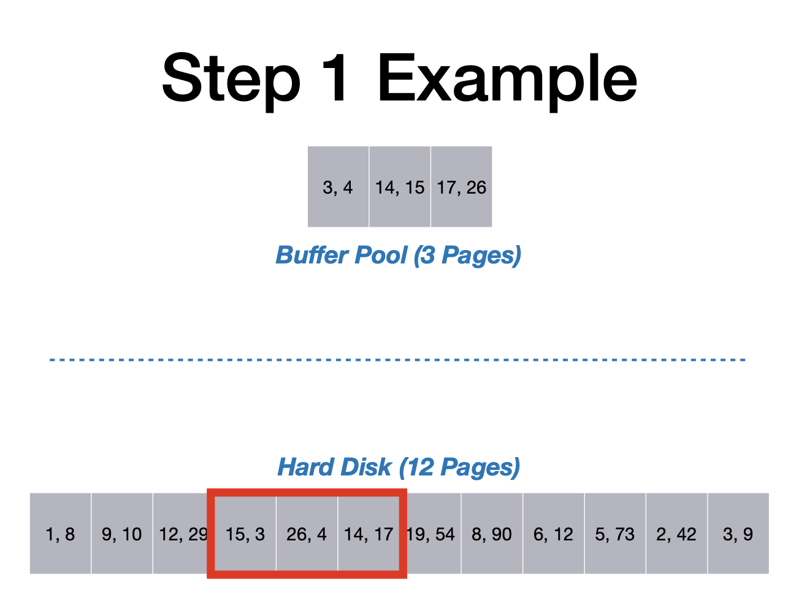
    - details on step 2..n
        - (Still have B buffer pages available)
        - Enables us to merge B-1 sorted runs into one in one step
        - Load first page of each sorted run into B-1 pages 
        - Copy minimum entry in input buffers to output buffer
            - If output buffer full, write to disk and clear 
        - Erase minimum entry from input buffer
            - If input buffer becomes empty, load next page 
    - Example Summary (phase 1)
        - Have 12 pages to sort with 3 buffer pages
        - First step: produce 4 sorted runs of length 3 
        - Can merge 2 (B-1) runs in each merge step
        - Second step: produce 2 sorted runs of length 6 
        - Third step: produce 1 sorted run of length 12
    - cost analysis (phase 1)
        - Multiple sorting passes, we read and write data once in each
        - Cost per pass is 2 * N (N is number of pages) 
        - How many steps must we make with B buffer pages?
            - First step produces runs of length B
            - Second step produces runs of length (B-1) * B
            - Third step produces runs of length (B-1) * (B-1) * B ...
            - Stop once (B-1)^{steps-1}*B ≥ N, after 1+Ceil(log_{B-1}(N/B)) steps
    - join phase 2: overview
        - (Have sorted both input tables by their join column) 
        - Load first page of both sorted tables into memory 
        - Find matching tuples and add to join result output 
        - Load next page for table with smallest last entry 
        - Keep doing until no pages left for one table
    - handling many duplicates
        - May have duplicates over multiple pages 
        - Must revert to first page with duplicate whenever we load new page from other table
        - This makes the join more expensive
    - cost analysis (phase 2)
        - For now: assume that all duplicate entries on same page
            - Duplicate entry: same value in join column 
        - Means that each input page is only read once 
        - Cost is proportional to number of input pages
            - I.e., Pages from both input tables 
    - total join costs
        - Two input tables with M and N pages, B buffer pages 
        - First phase has cost
            - 2*M*(1+Ceil(log_{B-1}(M/B))) for sorting table 1
            - 2*N*(1+Ceil(logB-1(M/B))) for sorting table 2 
        - Second phase has cost
            - M+N (we don't count cost for writing output!)
    - total memory
        - First phase: try to exploit all buffer pages
            - More buffer means less merging passes! 
        - Second phase: only exploit three buffer pages
            - One for first input, one for second input, one output
    - refined sort-merge join
        - Idea: can merge more than two sorted tables in phase 2 
        - Hence, do not need to sort tables completely in phase 1 
        - Means we can save steps (i.e., passes over the data) 
        - First phase: only sort data chunks that fit into memory 
        - Second phase: join all sorted chunks together (one step)
        - details
            - Assume B buffer pages, tables with N and M pages 
            - First phase: load chunks of B pages, sort, write back
                - We now have (N+M)/B sorted chunks on disk 
            - Second phase: merge B-1 sorted chunks together
                - Can sort entries in-memory to find matches 
            - Cost is 2*(M+N) (Phase 1) + 1 * (M+N) (Phase 2)
        - how much memory?
            - Again, B buffer pages, input sizes are M and N 
            - Have (N+M)/B sorted runs after first phase 
            - Need B-1 ≥ (N+M)/B to merge them in one step 
            - Rule of thumb if N>M: need B ≥ 2*Sqrt(N)
- R-SMJ vs. Hash Join
    - Hash join
        - time: 3 * input_size
        - memory: > sqrt(smaller table size)
        - advantage: parallelization
    - Refined Sort-Merge Join
        - time: 3 * input_size
        - memory: > 2 * sqrt(larger table size)
        - advantage: skew-resistance

# More operators and query plans
- projection (\pi)
    - projection operator
        - straightforward for SELECT without DISTINCT
            - Calculate SELECT items, drop other columns 
        - More difficult if DISTINCT keyword is present
            - Need to filter out duplicates - multiple options
                - hash
                - sorting 
                - index
- projection & duplication elimination via Hashing
    - Phase 1: partition data into hash buckets
        - Scan input, calculate projection, partition by hash function
        - Data partitions are written back to hard disk 
    - Phase 2: eliminate duplicates for each partition
        - Read one partition into memory and eliminate duplicates
        - Can use second hash function to detect duplicates 
    - Constraints on memory similar as for hash join
        - Count hash buckets for Phase 1, bucket size for Phase 2
    - cost = 3 * # pages
- Sorting
    - Idea: sorting rows helps finding duplicates
        - (Duplicates appear consecutively)
    - Use variant of external sort algorithm seen before
        - Apply projection during first pass over data
        - Eliminate in-memory duplicates during all steps
        - The result is duplicate-free and sorted
        - Can reduce number of passes with more main memory
    - cost = external sorting cost
- index
    - Assume index key includes projection columns
        - Can retrieve relevant data from index alone
        - Saves cost considering index smaller than data 
    - Even better: tree index with projections as key prefix
        - Duplicates retrieved consecutively, easy to eliminate
    - cost = reading index data
- Grouping (\Gamma) & Aggregation (\Sigma)
    - aggregation with groups
        - hashing
            - Maintain hash table of group keys with aggregates 
        - sorting
            - Sort on group keys, aggregate groups consecutively 
        - indexes
            - Index key must contain group-by keys
- set operations
    - INTERSECT can be handled like a join
        - Join condition is equality on all columns 
    - UNION eliminates duplicates (unlike UNION ALL)
        - Either hash and eliminate duplicates in each bucket
        - Or sort and eliminate duplicates during merging 
    - R EXCEPT S
        - Either partition via hash, then treat each bucket separately 
        - Or sort and check whether R tuple in S during merge steps
- query plans
    - Query plans describes query processing as tree 
    - Inner nodes are operators, leaf nodes are tables 
    - Logical query plan just specifies types of operations 
    - Physical query plan specifies implementation as well
    - passing results between operators
        - write output to disk 
            - may lead to unnecessary read/write overheads
        - keep intermediate results in main memory
            - may not be possible depending on size
            - pipelined operator passes result in-memory to next operation
            - label 'on the fly' for unary operators means pipelined input
    - Pipelined Nested Loop Joins
        - Full join output may be too large to fit in memory 
        - Hence, produce small join result parts consecutively 
        - Directly invoke next operator for result part in memory 
        - Can easily chain nested loop joins in this way
            - Can start producing output with part of left input 
        - do not count output cost of final operator
        - 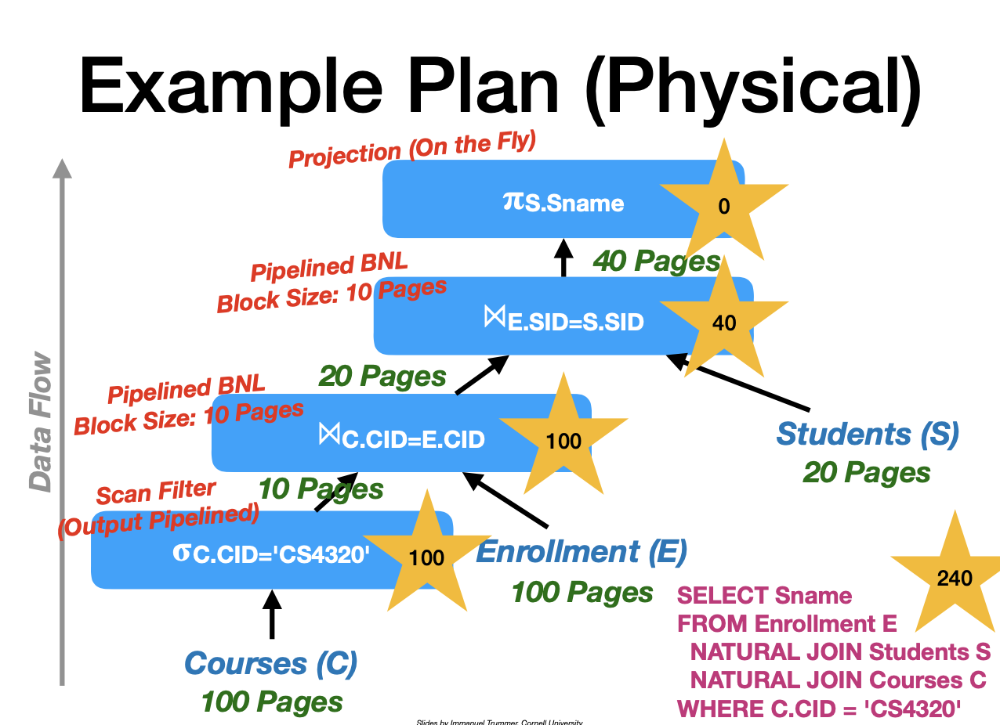
    
## query optimization
- data statistics in Postgres
    - Force DBMS to create statistics via VACUUM ANALYZE 
    - Generated statistics are exploited by query optimizer
        - Inexplicably bad performance? 
            - Might miss statistics 
    - Can access column statistics via pg_stats view
        - E.g., tablename, attname, n_distinct, null_frac, ...
- estimating selectivity
    - Selectivity: probability that row satisfies predicate 
    - Estimate via constraints and data statistics
    - E.g., Selectivity(Column=Value) = 1/NrValues 
        - assumes uniform data
    - E.g., NrRows(Column=Value) ≤ 1 if Key Column 
    - Selectivity(A⋀B) = Selectivity(A) * Selectivity(B)
        - assumes independent predicates
- estimating cardinality
    - Assume that cardinality of single tables is given
        - DBMS store that information for each base table 
    - Calculate cardinality product for tables in from clause
        - = Number of result rows if predicates are always true 
    - Now multiply with selectivity estimates for all predicates
        - Estimate how many rows pass predicate filter 
- estimating page size
    - Cost functions are based on number of data pages 
    - Calculate average byte size per record for each result 
    - Calculate how many records fit on one data page
        - Pages cannot store fractional records -> round down 
    - Divide number of rows by number of records per page
        - Result is size, measured in pages 
- estimating cost
    - Generally only count cost of page reads and writes 
    - Sum up cost over all operators in the plan
    - For each operator consider the following:
        - For each input, how often is it read from disk?
        - For each output, is it written to disk? Is it final result? 
        - Does the operator read/write intermediate results?
- selectivity estimation    
    - 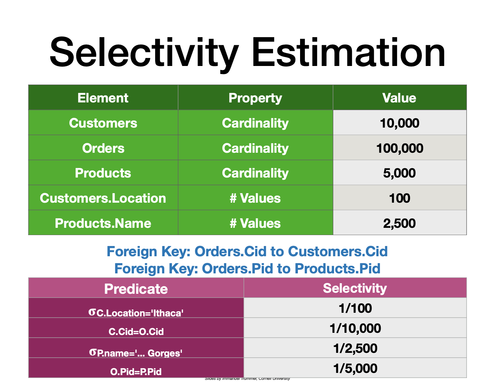
    - 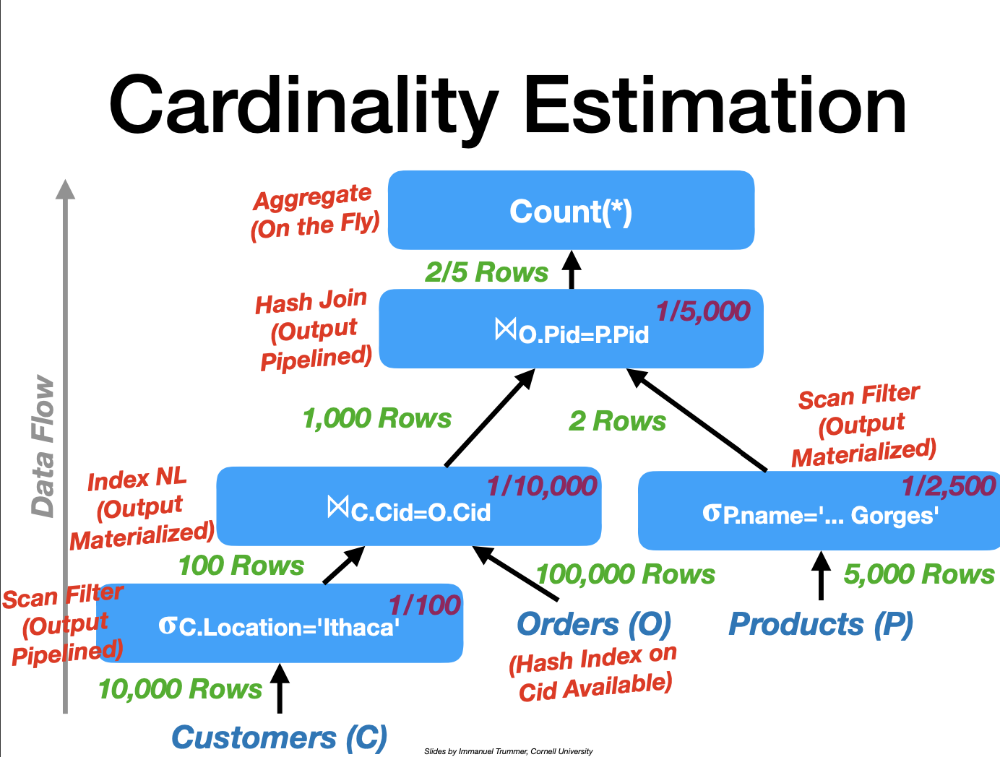
    - 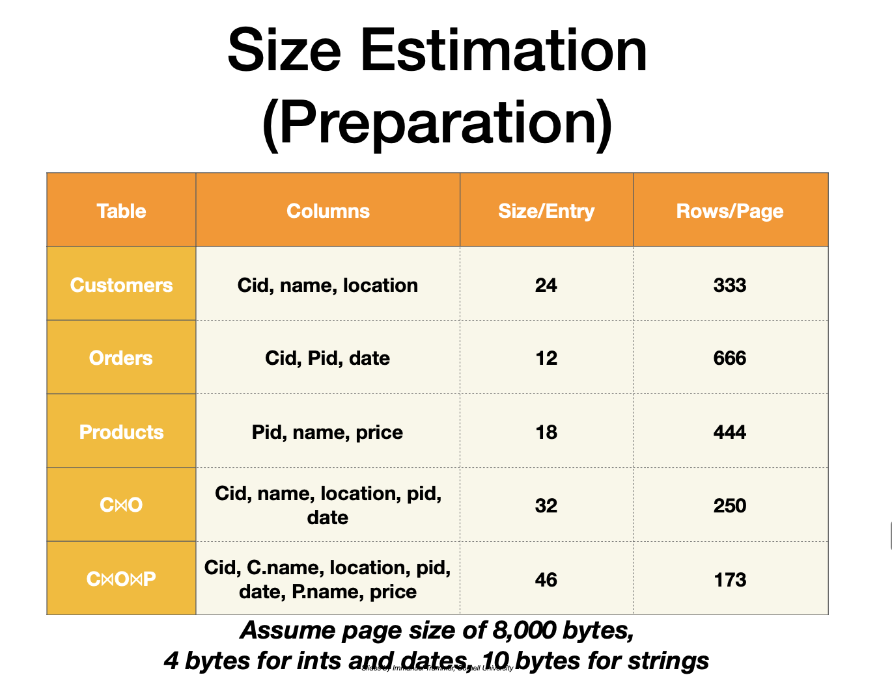
        - index NL = index nested loop join
- query plan space
    - Decide order of operations and implementation 
    - Apply heuristic restrictions
        - H1: Apply predicates/projections early 
            - Processing more data is more expensive
            - Want to reduce data size as quickly as possible
            - Can do that by adding predicates (discarding rows)
            - Can also do that by adding projections (discard columns)
        - H2: Avoid predicate-less joins
            - Join result size: product of input cardinality * selectivity
            - Selectivity is one when joining tables without predicates 
            - Often means very large join results, probably sub-optimal --
            - (Heuristic may discard optimal order in special cases)
        - H3: Focus on left-deep plans
            - Allows pipelining: joins pass on result parts in-memory 
            - Allows to use indices on join columns (of base tables)
- principle of optimality
    - Want cheapest plan to join set of tables
    - This plan joins table subsets "on the way"
    - Assume we use sub-optimal plan for joining table subset 
    - Replacing by a better plan can only improve overall cost 
    - This is generally called the principle of optimality
- efficient optiimzation
    - Find optimal plans for (smaller) sub-queries first
        - Sub-query: joins subsets of tables
    - Compose optimal plans from optimal sub-query plans
    - 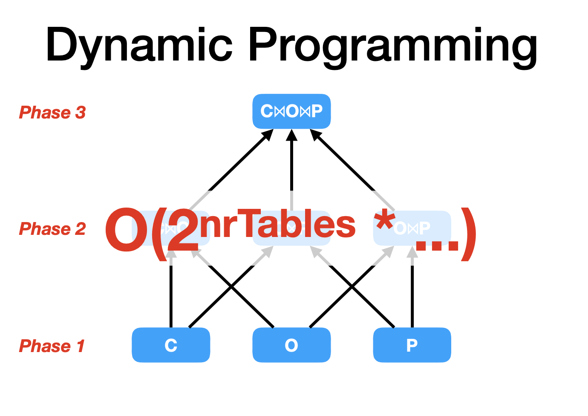